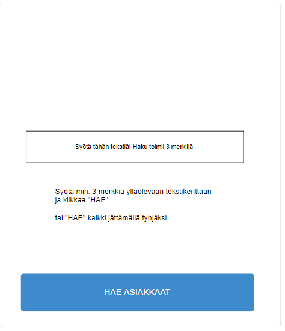
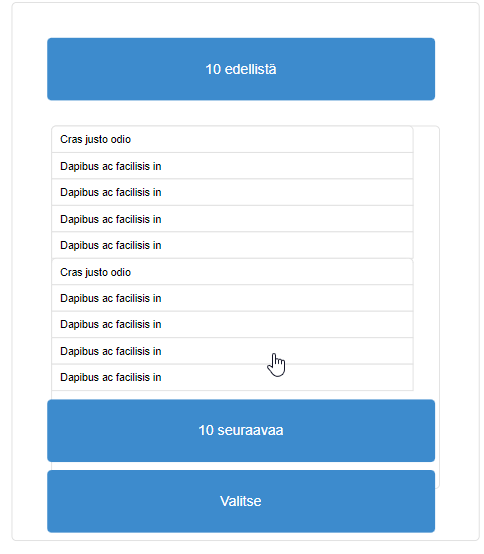
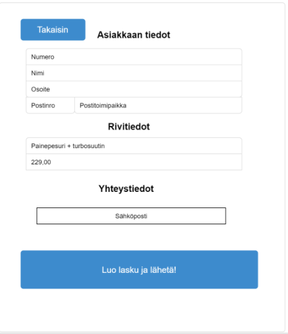

## Toiminnallisuus

Laskun tulostaminen pdf-muotoon tietokantaan tallennetuista asiakastiedoista. 

Tulostuksen pitää toimia puhelimellakin ja nappeihin pitää osua myös pakkasella sormikkaat kädessä. 

## Teknologiat 
* UI esim. React.js + TypeScript 
* API esim. node.js (+TypeScript) 
* DB esim. MongoDB 
* Docker 
* Robotframework automaatiotestaus 

## Työkalut 
* Git 
* Slack

## Käyttöliittymä 

1. Hae asiakkaat
- syötä min. 3 merkkiä tai numeroa, joita käytetään haun parametrina.
tai
- hae kaikki, jos kenttä on tyhjä

2. Valitse listalta asiakas
- näytetään 10
- mahdollisuus kelata listaa ylös ja alas
- valitaan ja jatketaan.

3. Luodaan lasku
- tarkistetaan tiedot
- syötetään rivitieto ja summa
- mahdollisuus syöttää s-posti ja puhelinnumero laskun lähettämistä varten

